<!-- ════════════════════════════════════════════════════════════════════ -->
<!--                    CHANNU PATIL — GITHUB PROFILE                   -->
<!-- ════════════════════════════════════════════════════════════════════ -->

<div align="center">

<!-- HERO BANNER -->


<br/>

<!-- TYPING ANIMATION -->
<a href="https://git.io/typing-svg">
  
</a>

<br/>

<!-- SOCIAL BADGES -->
[](https://www.linkedin.com/in/channu-patil-a61526371/)
[](https://www.instagram.com/_channu_patil_/?hl=en)
[](https://github.com/Channu0012)
[](#)


</div>

<!-- DIVIDER -->


<br/>

##  &nbsp;About Me

```js
const channu = {
    name: "Channu Patil",
    role: ["Developer", "Entrepreneur", "Builder"],
    location: "India 🇮🇳",
    currentFocus: "Building AI-powered products & SaaS platforms",
    philosophy: "Learn every day. Build every day. Improve by 1% every day.",
    funFact: "I read startup books for fun and debug code for peace 🧘‍♂️"
};
```


- 🔭 &nbsp;Currently building **AI-powered applications** & **SaaS products**
- 🌱 &nbsp;Deep diving into **AI/ML**, **Multi-Agent Systems** & **Cloud Architecture**
- 🚀 &nbsp;Passionate about solving **real-world problems** with technology
- 📚 &nbsp;Avid reader — *Atomic Habits, Zero to One, Clean Code*
- 💡 &nbsp;Entrepreneur mindset — always looking for the next **big idea**
- 🤝 &nbsp;Open to **collaborations** on innovative projects
- ⚡ &nbsp;Daily habit: *Code → Learn → Build → Repeat*

<br/>

<!-- DIVIDER -->


<br/>

##  &nbsp;Tech Arsenal

<div align="center">

### 🎨 Frontend & Mobile


### ⚙️ Backend & APIs


### 🗄️ Database & Cloud


### 🧠 AI & Automation


### 🛠️ Tools & DevOps


</div>

<br/>

<!-- DIVIDER -->


<br/>

##  &nbsp;Featured Projects

<div align="center">

<table>
<tr>
<td width="50%" valign="top">

### 🧠 FlowMind AI
**Local Multi-Agent AI Orchestration Dashboard**

> A secure, offline-first multi-agent system with 6 AI agents (Planner, Researcher, Coder, Writer, Reviewer, Executor) running locally via Ollama

**Tech Stack:**
`Python` `FastAPI` `React` `CrewAI` `Ollama` `SQLModel` `WebSockets` `Zustand`

**Highlights:**
- 🔒 100% offline — runs on 16GB RAM
- 🤖 Dual-model strategy (Llama 3.2 + Qwen 2.5)
- 🛡️ AES-256 encrypted SQLite storage
- 🎯 Manual confirmation shield for safety

<a href="https://github.com/Channu0012">
  
</a>

</td>
<td width="50%" valign="top">

### 🎬 StreamVerse
**Full-Stack Movie Discovery Platform**

> A feature-rich movie discovery platform with JWT auth, RESTful API, admin panel, SEO optimization, and multi-platform deployment

**Tech Stack:**
`Next.js` `Express.js` `PostgreSQL` `Firebase` `TailwindCSS` `JWT` `Vercel`

**Highlights:**
- 🎥 Complete movie discovery with genres & platforms
- 🔐 JWT authentication & role-based access
- 📊 Analytics tracking & SEO metadata
- 🚀 Deployed on Vercel + Netlify + Render

<a href="https://github.com/Channu0012">
  
</a>

</td>
</tr>

<tr>
<td width="50%" valign="top">

### 📱 SkillVerse
**Social Network Learning Application**

> A Flutter-based social learning app with gamification, battles, leaderboards, real-time messaging, and Firebase backend

**Tech Stack:**
`Flutter` `Dart` `Firebase Auth` `Firestore` `Riverpod` `Isar` `Dio` `Lottie`

**Highlights:**
- 🏆 Gamified learning with battles & leaderboards
- 💬 Real-time messaging & notifications
- 🎨 Google Fonts + Lottie animations
- 📱 Cross-platform (Android + Web)

<a href="https://github.com/Channu0012">
  
</a>

</td>
<td width="50%" valign="top">

### 🛒 Affiliate Marketing Hub
**SaaS Product Comparison Platform**

> An Express.js + Firebase affiliate marketing hub with admin panel, analytics dashboard, click tracking, and SEO-optimized templates

**Tech Stack:**
`Node.js` `Express.js` `Firebase RTDB` `HTML5` `CSS3` `JavaScript`

**Highlights:**
- 📈 Real-time click & impression analytics
- 🔄 Firebase Cloud ↔ Local JSON dual persistence
- 🛒 Multi-platform affiliate link routing
- 📧 Price drop alert subscription system

<a href="https://github.com/Channu0012">
  
</a>

</td>
</tr>
</table>

</div>

<br/>

<!-- ALSO WORKING ON -->
<details>
<summary><b>🔬 Other Projects & Ideas in Progress</b></summary>
<br/>

| Project | Description | Status |
|---------|-------------|--------|
| 🚌 **Bus Price Comparer** | SaaS for comparing bus ticket prices across platforms | 🔧 In Development |
| 💬 **WhatsApp AI Agent** | AI-powered WhatsApp automation assistant | 🧪 Prototyping |
| 🎯 **Interview Arena** | Learn, compete, win, and get placed — gamified interview prep | 🎨 UI Complete |
| 📊 **Reels Counter** | Social media analytics tool | 📋 Planning |
| 📅 **Day Tracker** | Personal productivity & habit tracker | 📋 Planning |

</details>

<br/>

<!-- DIVIDER -->


<br/>

##  &nbsp;GitHub Analytics

<div align="center">

<!-- GITHUB STATS -->
<a href="https://github.com/Channu0012">
  
</a>
&nbsp;
<a href="https://github.com/Channu0012">
  
</a>

<br/><br/>

<!-- STREAK STATS -->
<a href="https://github.com/Channu0012">
  
</a>

<br/><br/>

<!-- ACTIVITY GRAPH -->
<a href="https://github.com/Channu0012">
  
</a>

</div>

<br/>

<!-- DIVIDER -->


<br/>

##  &nbsp;GitHub Trophies

<div align="center">

<a href="https://github.com/Channu0012">
  
</a>

</div>

<br/>

<!-- DIVIDER -->


<br/>

##  &nbsp;My Philosophy

<div align="center">

<br/>

```
╔══════════════════════════════════════════════════════════════╗
║                                                              ║
║    📖  Learn every day.                                      ║
║    🔨  Build every day.                                      ║
║    📈  Improve by 1% every day.                              ║
║                                                              ║
║    "The best way to predict the future is to create it."     ║
║                                        — Abraham Lincoln     ║
║                                                              ║
╚══════════════════════════════════════════════════════════════╝
```

<br/>

<table>
<tr>
<td align="center" width="25%">


**Developer**

*Writing clean, scalable code that solves real problems*

</td>
<td align="center" width="25%">


**Entrepreneur**

*Building products people actually want to use*

</td>
<td align="center" width="25%">


**Builder**

*From idea to MVP to launched product*

</td>
<td align="center" width="25%">


**Lifelong Learner**

*1% better every day compounds to greatness*

</td>
</tr>
</table>

</div>

<br/>

<!-- DIVIDER -->


<br/>

##  &nbsp;Currently Reading

<div align="center">

| 📚 Book | ✍️ Author | 💡 Key Takeaway |
|---------|-----------|-----------------|
| *Atomic Habits* | James Clear | Small habits → remarkable results |
| *Zero to One* | Peter Thiel | Build monopolies, not competition |
| *Clean Code* | Robert C. Martin | Code is craft, treat it with respect |
| *The Lean Startup* | Eric Ries | Build → Measure → Learn |
| *The Psychology of Money* | Morgan Housel | Behavior > Intelligence in finance |

</div>

<br/>

<!-- DIVIDER -->


<br/>

##  &nbsp;Let's Connect

<div align="center">

<br/>

**💬 I'm always open to discussing new projects, creative ideas, or opportunities to be part of your vision.**

<br/>

[](https://www.linkedin.com/in/channu-patil-a61526371/)
&nbsp;
[](https://www.instagram.com/_channu_patil_/?hl=en)
&nbsp;
[](https://github.com/Channu0012)

<br/>

📧 **Reach out** — Let's build something amazing together!

<br/>

</div>

<!-- SNAKE ANIMATION -->
<div align="center">
  
</div>

<br/>

<!-- FOOTER -->


<div align="center">

<br/>


<br/>

**⭐ From [Channu0012](https://github.com/Channu0012) — Building the future, one commit at a time.**

*If you found my profile interesting, don't forget to give a ⭐!*


</div>

<!-- 
    ╔══════════════════════════════════════════════════════════╗
    ║                                                          ║
    ║   Designed & built with 💜 by Channu Patil               ║
    ║   "Building the future through code."                    ║
    ║                                                          ║
    ╚══════════════════════════════════════════════════════════╝
-->
