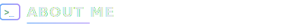
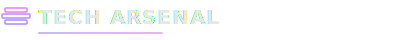
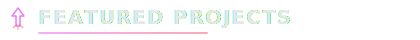
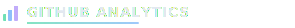
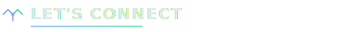

<!-- ═══════════════════════════════════════════════════════════════════════ -->
<!--                  CHANNU PATIL — PREMIUM GITHUB PROFILE                -->
<!--               Developer  ·  Entrepreneur  ·  Builder                  -->
<!-- ═══════════════════════════════════════════════════════════════════════ -->

<div align="center">

<!-- ═══════ HERO BANNER ═══════ -->


<br/>

<!-- ═══════ TYPING ANIMATION ═══════ -->
<a href="https://git.io/typing-svg">
  
</a>

<br/>

<!-- ═══════ SOCIAL BADGES (Modern flat style) ═══════ -->
<a href="https://www.linkedin.com/in/channu-patil-a61526371/"></a>&nbsp;
<a href="https://www.instagram.com/_channu_patil_/?hl=en"></a>&nbsp;
<a href="https://github.com/Channu0012"></a>&nbsp;


</div>

<br/>

<!-- ═══════════════════════════════════════════════════════ -->

<br/>

<!-- ═══════ ABOUT ME ═══════ -->


<br/>

```typescript
const channu: Developer = {
    name       : "Channu Patil",
    roles      : ["Full-Stack Developer", "Entrepreneur", "Product Builder"],
    location   : "India 🇮🇳",
    focus      : "AI-Powered Products & SaaS Platforms",
    languages  : ["JavaScript", "TypeScript", "Python", "Dart"],
    philosophy : "Learn → Build → Ship → Iterate → Repeat",
    goal       : "Create technology that makes people's lives easier",
};
```

<table>
<tr>
<td width="50%" valign="top">

**What I'm Working On**

 &nbsp; Building **AI-powered multi-agent** systems  
 &nbsp; Developing **full-stack SaaS** products  
 &nbsp; Exploring **LLMs, CrewAI** & AI automation  
 &nbsp; Cross-platform apps with **Flutter**  

</td>
<td width="50%" valign="top">

**What Drives Me**

 &nbsp; Solving **real-world problems** with code  
 &nbsp; Reading books on **startups & psychology**  
 &nbsp; Shipping **MVPs fast**, iterating faster  
 &nbsp; Compounding **1% daily** improvements  

</td>
</tr>
</table>

<br/>

<!-- ═══════════════════════════════════════════════════════ -->

<br/>

<!-- ═══════ TECH ARSENAL ═══════ -->


<br/>

<div align="center">

<!-- Frontend & Mobile -->
<details open>
<summary><b>&nbsp;&nbsp;Frontend & Mobile</b></summary>
<br/>
<a href="#"></a>
</details>

<!-- Backend & APIs -->
<details open>
<summary><b>&nbsp;&nbsp;Backend & APIs</b></summary>
<br/>
<a href="#"></a>
</details>

<!-- Database & Cloud -->
<details open>
<summary><b>&nbsp;&nbsp;Database & Cloud</b></summary>
<br/>
<a href="#"></a>
</details>

<!-- AI & Tools -->
<details open>
<summary><b>&nbsp;&nbsp;AI, Automation & Tools</b></summary>
<br/>
<a href="#"></a>
<br/><br/>


</details>

</div>

<br/>

<!-- ═══════════════════════════════════════════════════════ -->

<br/>

<!-- ═══════ FEATURED PROJECTS ═══════ -->


<br/>

<div align="center">

<!-- PROJECT 1: FlowMind AI -->
<a href="https://github.com/Channu0012">

</a>

</div>

<table>
<tr>
<td width="50%" valign="top">

<h3 align="center">

&nbsp;FlowMind AI
</h3>

<p align="center">

</p>

> **Local AI Orchestration Dashboard** — A secure, offline-first multi-agent system with 6 AI agents running locally via Ollama. Features dual-model strategy (Llama 3.2 + Qwen 2.5), AES-256 encryption, and a React dashboard.

<p align="center">


</p>

<p align="center">


</p>

</td>
<td width="50%" valign="top">

<h3 align="center">

&nbsp;StreamVerse
</h3>

<p align="center">

</p>

> **Movie Discovery Platform** — Full-stack app with JWT auth, RESTful API, admin panel, SEO optimization, analytics tracking, and multi-platform deployment (Vercel + Netlify + Render).

<p align="center">


</p>

<p align="center">


</p>

</td>
</tr>
<tr>
<td width="50%" valign="top">

<h3 align="center">

&nbsp;SkillVerse
</h3>

<p align="center">

</p>

> **Gamified Learning App** — Flutter-based social learning platform with skill battles, leaderboards, real-time messaging, Firebase backend, and beautiful Lottie animations.

<p align="center">


</p>

<p align="center">


</p>

</td>
<td width="50%" valign="top">

<h3 align="center">

&nbsp;Affiliate Marketing Hub
</h3>

<p align="center">

</p>

> **Product Comparison SaaS** — Express.js affiliate marketing platform with admin panel, click/impression analytics, Firebase cloud sync, and SEO-optimized dynamic templates.

<p align="center">


</p>

<p align="center">


</p>

</td>
</tr>
</table>

<br/>

<details>
<summary>&nbsp;&nbsp;<b>More Projects in the Pipeline</b></summary>
<br/>

<div align="center">

| &nbsp; | Project | Description | Tech | Status |
|:---:|---------|-------------|------|:------:|
|  | **Bus Price Comparer** | SaaS for comparing bus ticket prices across platforms | `Node.js` `APIs` |  |
|  | **WhatsApp AI Agent** | AI-powered conversational automation assistant | `Python` `AI` |  |
|  | **Interview Arena** | Gamified interview prep — learn, compete, get placed | `HTML5` `CSS3` `JS` |  |
|  | **Reels Counter** | Social media analytics & engagement tracker | `React` `APIs` |  |
|  | **Day Tracker** | Personal productivity & daily habit tracker | `Flutter` |  |

</div>

</details>

<br/>

<!-- ═══════════════════════════════════════════════════════ -->

<br/>

<!-- ═══════ GITHUB ANALYTICS ═══════ -->


<br/>

<div align="center">

<!-- Stats + Languages side by side -->
<a href="https://github.com/Channu0012">
  
</a>

<a href="https://github.com/Channu0012">
  
</a>

<br/><br/>

<!-- Streak Stats -->
<a href="https://github.com/Channu0012">
  
</a>

<br/><br/>

<!-- Activity Graph -->
<a href="https://github.com/Channu0012">
  
</a>

<br/><br/>

<!-- Trophies -->
<a href="https://github.com/Channu0012">
  
</a>

</div>

<br/>

<!-- ═══════════════════════════════════════════════════════ -->

<br/>

<!-- ═══════ PHILOSOPHY ═══════ -->


<br/>

<div align="center">

<table>
<tr>
<td align="center" width="170">


**Learn**  
*Every Day*


</td>
<td align="center" width="30">

`→`

</td>
<td align="center" width="170">


**Build**  
*Every Day*


</td>
<td align="center" width="30">

`→`

</td>
<td align="center" width="170">


**Ship**  
*Every Day*


</td>
<td align="center" width="30">

`→`

</td>
<td align="center" width="170">


**Improve**  
*1% Daily*


</td>
</tr>
</table>

<br/>

> *"The best way to predict the future is to create it."*

<br/>

<table>
<tr>
<td align="center" width="25%">


Writing clean, scalable  
code that solves  
**real problems**

</td>
<td align="center" width="25%">


Building products  
people actually  
**want to use**

</td>
<td align="center" width="25%">


From idea to MVP  
to **launched**  
**product**

</td>
<td align="center" width="25%">


1% better every day  
**compounds** to  
**greatness**

</td>
</tr>
</table>

</div>

<br/>

<!-- ═══════════════════════════════════════════════════════ -->

<br/>

<!-- ═══════ CONNECT ═══════ -->


<br/>

<div align="center">

<br/>

**I'm always open to discussing new projects, creative ideas, or opportunities.**  
**Let's build something that matters.**

<br/>

<a href="https://www.linkedin.com/in/channu-patil-a61526371/">
  
</a>
&nbsp;&nbsp;
<a href="https://www.instagram.com/_channu_patil_/?hl=en">
  
</a>
&nbsp;&nbsp;
<a href="https://github.com/Channu0012">
  
</a>

<br/><br/>

---

<br/>


<br/>

<sub>

**⚡ Designed & crafted by [Channu Patil](https://github.com/Channu0012)**  
*Building the future, one commit at a time.*

</sub>

<br/>


</div>

<!-- ═══════════════════════════════════════════════════════════════════════ -->
<!--                    Built with 💜 by Channu Patil                      -->
<!--                  "Building the future through code."                  -->
<!-- ═══════════════════════════════════════════════════════════════════════ -->
